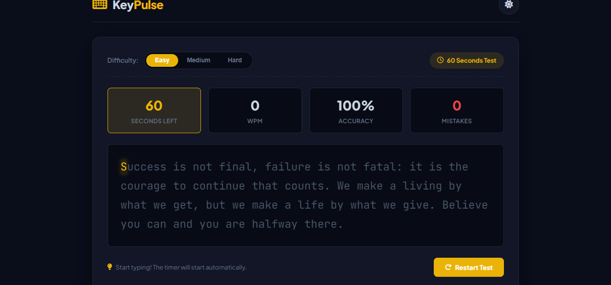
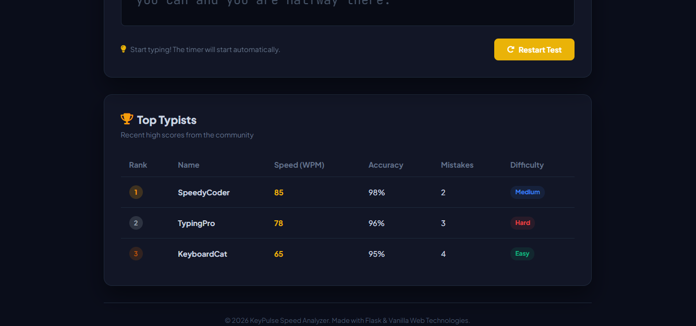

# KeyPulse: Modern Typing Speed Analyzer

# Project Name

Short description about your project.

## 🚀 Live Demo
🔗 https://type-craft-chi.vercel.app/ 

## 📌 Features
- 
- 
-

## 🛠️ Technologies Used
- HTML
- CSS
- JavaScript
- React / Django / Node.js

## 📂 Installation

```bash
git clone https://github.com/your-username/your-repo-name.git
cd your-repo-name

**KeyPulse** is a lightweight, modern web-based typing speed and accuracy analyzer. Developed using **Python Flask** for the backend and **semantic HTML5, Vanilla CSS3, and JavaScript (ES6)** for the frontend, it provides an aesthetic, game-like experience similar to Monkeytype or 10FastFingers. 

The application is structured to show clean development patterns, making it an excellent addition to a **GitHub portfolio** or as a **college project** that stands out in interviews and vivas.

---

## 🌟 Key Features

1. **Auto-Start Timer:** The 60-second test countdown begins automatically on the user's first keystroke.
2. **Real-time Character Highlight Tracking:** Letters color dynamically as you type (green for correct, red with underline for mistakes).
3. **Double Statistics Processing:** Counts active WPM, accuracy %, and raw mistakes in real-time, plus a final breakdown score.
4. **Endless Typing Mode:** If a user finishes the paragraph before the timer ends, a new paragraph automatically loads, keeping the clock running.
5. **Leaderboard System:** Submit and save high scores to a global in-memory leaderboard served via Flask API.
6. **Dual Theme Modes:** Sleek dark-mode aesthetic default with a modern light-mode alternate.
7. **Difficulty Customization:** Choose between Easy, Medium, and Hard difficulty levels.
8. **Quick Controls:** Key listener allows pressing `Escape` to instantly restart a test at any time.

---

## 📂 Project Architecture

The directory structure is modular and adheres to standard Flask development guidelines:

```
typing website/
├── app.py                 # Backend Flask application and API routing
├── requirements.txt       # Python dependencies
├── paragraphs.json        # Database file storing paragraph libraries
├── README.md              # Detailed project document (this file)
├── templates/
│   └── index.html         # Frontend HTML structure
└── static/
    ├── style.css          # Styling rules, design tokens, light/dark themes
    └── script.js          # App state, calculations, visual rendering and AJAX
```

---

## 🚀 Steps to Run the Project

### Prerequisites
Make sure you have **Python 3.8+** installed on your system.

### 1. Clone or Move to Workspace Directory
Open your terminal and navigate to the project directory:
```bash
cd "c:\Users\DELL\Desktop\typing website"
```

### 2. Install Dependencies
Install the required packages using `pip`:
```bash
pip install -r requirements.txt
```

### 3. Run the Server
Launch the Flask backend server:
```bash
python app.py
```

### 4. Open in Browser
Open your browser and navigate to:
```
http://127.0.0.1:5000/
```

---

## 🧠 Technical Concept & Math Formulas

To explain this project confidently during interviews or vivas, make sure you understand the following mechanics:

### 1. Words Per Minute (WPM) Formula
In professional typing metrics, a "word" is standardized as **5 characters** (including spaces). 
$$WPM = \frac{\text{Correct Characters} / 5}{\text{Time Elapsed in Minutes}}$$
*Example:* If a user types 150 correct characters in 30 seconds (0.5 minutes):
$$\text{WPM} = \frac{150 / 5}{0.5} = \frac{30}{0.5} = 60 \text{ WPM}$$

### 2. Accuracy Formula
$$\text{Accuracy \%} = \frac{\text{Total Characters Typed} - \text{Mistakes}}{\text{Total Characters Typed}} \times 100$$
*Note:* Accuracy represents correct keystrokes over total keystrokes typed (excluding backspaces).

### 3. The Hidden Input Trick
Instead of typing into a standard textarea box which blocks visual layout customization, **KeyPulse uses an invisible textarea (`opacity: 0; pointer-events: none;`)**. When the user clicks the typing card, the page focuses this invisible textarea. JavaScript captures every character inputted and updates individual letter `<span>` tags on-screen. This is how premium sites implement custom blinking cursors and letter colors.

---

## 🎓 Viva & Presentation Q&A Study Guide

*Here are typical questions external examiners ask about this project:*

* **Q: Why did you use Python Flask instead of pure HTML/JS?**
  * *A:* Flask enables building API routes. Instead of hardcoding paragraphs in JavaScript, they are stored in `paragraphs.json` on the server and loaded dynamically. Flask also hosts the leaderboard backend to handle requests, filter scores, and manage state in real-time.
* **Q: Where is the leaderboard data saved?**
  * *A:* Currently, data is saved in-memory inside a global python list `LEADERBOARD` inside `app.py`. When a POST request is sent to `/api/scores`, the entry is added, sorted, and the top 5 are returned. *(Note: Restarting the server resets the leaderboard. This is perfect for local testing without database setups).*
* **Q: How does the application prevent cross-site scripting (XSS) on the leaderboard?**
  * *A:* In `script.js`, any username displayed on the leaderboard table is passed through an `escapeHTML()` helper function which replaces brackets and script-tags (`<script>`) with safe HTML entities like `&lt;` and `&gt;`.
* **Q: How does the timer start automatically?**
  * *A:* An event listener on the input area checks if the boolean `hasStarted` is false. On the very first keystroke, `hasStarted` changes to true, and `setInterval()` is invoked to decrement the timer.

---

## 🚀 Future Enhancements (Perfect for Resume Upgrades)

To make this project even better for professional portfolios:
1. **Persistent Database:** Connect the Flask backend to an **SQLite** database using `Flask-SQLAlchemy` to save users' typing profiles and score history permanently.
2. **Interactive SVG Charts:** Integrate **Chart.js** on the results modal to draw a line chart showing speed changes (WPM) second-by-second during the test.
3. **Custom Test Timers:** Allow users to choose test durations of 15, 30, or 100 seconds instead of a hardcoded 60 seconds.
4. **Custom Text Upload:** Allow teachers or users to upload their own paragraphs for typing practice.
5. **Real-time Multiplayer races:** Add **WebSockets (Flask-SocketIO)** to allow two users to connect and race typing speed head-to-head in real time.
